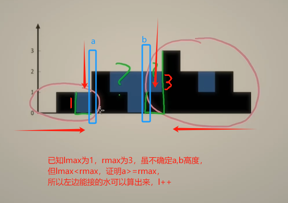

#### 1.哈希

[1. 两数之和](https://leetcode.cn/problems/two-sum/)

给定一个整数数组 `nums` 和一个整数目标值 `target`，请你在该数组中找出 **和为目标值** *`target`* 的那 **两个** 整数，并返回它们的数组下标。

你可以假设每种输入只会对应一个答案，并且你不能使用两次相同的元素。

你可以按任意顺序返回答案。

**示例 1：**

```
输入：nums = [2,7,11,15], target = 9
输出：[0,1]
解释：因为 nums[0] + nums[1] == 9 ，返回 [0, 1] 。
```

**示例 2：**

```
输入：nums = [3,2,4], target = 6
输出：[1,2]
```

**示例 3：**

```
输入：nums = [3,3], target = 6
输出：[0,1]
```

**提示：**

- `2 <= nums.length <= 104`
- `-109 <= nums[i] <= 109`
- `-109 <= target <= 109`
- **只会存在一个有效答案**

 **进阶：**你可以想出一个时间复杂度小于 `O(n2)` 的算法吗？

```java
// 使用map储存（nums[i], i），遍历时求target - nums[i]
class Solution {
    public int[] twoSum(int[] nums, int target) {
        Map<Integer, Integer> map = new HashMap<>();
        for(int i = 0; i < nums.length; i ++ ) {
            int ans = target - nums[i];
            if(map.containsKey(ans)) {
                return new int[]{map.get(ans), i};
            }
            map.put(nums[i], i);
        }
        return new int[2];
    }
}
```

[49. 字母异位词分组](https://leetcode.cn/problems/group-anagrams/)

给你一个字符串数组，请你将 **字母异位词** 组合在一起。可以按任意顺序返回结果列表。

**字母异位词** 是由重新排列源单词的所有字母得到的一个新单词。

**示例 1:**

```
输入: strs = ["eat", "tea", "tan", "ate", "nat", "bat"]
输出: [["bat"],["nat","tan"],["ate","eat","tea"]]
```

**示例 2:**

```
输入: strs = [""]
输出: [[""]]
```

**示例 3:**

```
输入: strs = ["a"]
输出: [["a"]]
```

**提示：**

- `1 <= strs.length <= 104`
- `0 <= strs[i].length <= 100`
- `strs[i]` 仅包含小写字母

```java
// 使用map储存（aet, ["ate","eat","tea"]），key为string转换为char[]后排序
class Solution {
    public List<List<String>> groupAnagrams(String[] strs) {
        // key储存排序后String，[aet, ["ate","eat","tea"]]
        Map<String, List<String>> map = new HashMap<>();
        for(String str: strs) {
            char[] c = str.toCharArray();
            Arrays.sort(c);
            String sortStr = new String(c);
            List<String> list;
            if(map.containsKey(sortStr)) {
                list = map.get(sortStr);
            }
            else {
                list = new ArrayList<>();
            }
            list.add(str);
            map.put(sortStr, list);
        }
        List<List<String>> ans = new ArrayList<>();
        for(String s : map.keySet()) {
            ans.add(map.get(s));
        }
        return ans;
    }
}

// 使用map储存（a1e1t1, ["ate","eat","tea"]），key为string中字母+数量
class Solution {
    public List<List<String>> groupAnagrams(String[] strs) {
        // key储存字母+数量，[a1e1t1, ["ate","eat","tea"]]
        Map<String, List<String>> map = new HashMap<>();
        for(String str : strs) {
            char[] c = str.toCharArray();
            int[] nums = new int[26];
            for(int i = 0; i < c.length; i ++ ) {
                nums[c[i] - 'a'] ++ ;
            }
            StringBuffer sb = new StringBuffer();
            for(int i = 0; i < 26; i ++ ) {
                if(nums[i] != 0) {
                    sb.append((char)('a' + i)).append(nums[i]);
                }
            }
            String s = sb.toString();
            List<String> list = map.getOrDefault(s, new ArrayList<>());
            list.add(str);
            map.put(s, list);
        }
        return new ArrayList<>(map.values());
    }
}
```

[128. 最长连续序列](https://leetcode.cn/problems/longest-consecutive-sequence/)

给定一个未排序的整数数组 `nums` ，找出数字连续的最长序列（不要求序列元素在原数组中连续）的长度。

请你设计并实现时间复杂度为 `O(n)` 的算法解决此问题。

**示例 1：**

```
输入：nums = [100,4,200,1,3,2]
输出：4
解释：最长数字连续序列是 [1, 2, 3, 4]。它的长度为 4。
```

**示例 2：**

```
输入：nums = [0,3,7,2,5,8,4,6,0,1]
输出：9
```

**提示：**

- `0 <= nums.length <= 105`
- `-109 <= nums[i] <= 109`

```java
// map储存（数字，该数字序列的长度）,根据map判断前后数字得出当前num的序列，并更新该num序列的前端与后端
class Solution {
    public int longestConsecutive(int[] nums) {
        if(nums.length == 0) return 0;
        Map<Integer, Integer> map = new HashMap<>();
        int max = -1;
        for(int num : nums) {
            if(!map.containsKey(num)) {
                int last = map.getOrDefault(num - 1, 0);// 上一个数
                int next = map.getOrDefault(num + 1, 0);// 下一个数
                int count = last + 1 + next;
                max = Math.max(count, max);
                map.put(num, count);
                if(map.containsKey(num - last)) map.put(num - last, count);// 更新序列的前端
                if(map.containsKey(num + next)) map.put(num + next, count);// 更新序列的后端
            // System.out.println(num + " " + map.get(num));
            }
        }
        return max;
    }
}

// 官方：使用set储存数组元素，找到序列的第一个元素遍历求len
class Solution {
    public int longestConsecutive(int[] nums) {
        Set<Integer> set = new HashSet<>();
        for(int num: nums) {
            set.add(num);
        }
        int max = 0;
        for(int num: nums) {
            if(!set.contains(num - 1)) {
                int len = 1;
                while(set.contains(num + 1)) {
                    num ++ ;
                    len ++ ;
                }
                max = Math.max(max, len);
            }
        }
        return max;
    }
}
```

#### 2.双指针

[283. 移动零](https://leetcode.cn/problems/move-zeroes/)

给定一个数组 `nums`，编写一个函数将所有 `0` 移动到数组的末尾，同时保持非零元素的相对顺序。

**请注意** ，必须在不复制数组的情况下原地对数组进行操作。

**示例 1:**

```
输入: nums = [0,1,0,3,12]
输出: [1,3,12,0,0]
```

**示例 2:**

```
输入: nums = [0]
输出: [0]
```

**提示**:

- `1 <= nums.length <= 104`
- `-231 <= nums[i] <= 231 - 1`

**进阶：**你能尽量减少完成的操作次数吗？

```java
class Solution {
    public void moveZeroes(int[] nums) {
        int l = 0, r = 0;
        int n = nums.length;
        while(r < n) {
            if(nums[r] != 0) {
                nums[l ++ ] = nums[r];
            }
            r ++ ;
        }
        while(l < n) {
            nums[l ++] = 0;
        }
        return ;
    }
}
class Solution {
    // 把非零元素往左换，保证l左边均不是非零元素
    public void moveZeroes(int[] nums) {
        int l = 0, r = 0, n = nums.length;
        while(r < n) {
            if(nums[r] != 0) {
                int tmp = nums[r];
                nums[r] = nums[l];
                nums[l] = tmp;
                l ++ ;
            }
            r ++ ;
        }
    }
}
```

[11. 盛最多水的容器](https://leetcode.cn/problems/container-with-most-water/)

给定一个长度为 `n` 的整数数组 `height` 。有 `n` 条垂线，第 `i` 条线的两个端点是 `(i, 0)` 和 `(i, height[i])` 。找出其中的两条线，使得它们与 `x` 轴共同构成的容器可以容纳最多的水。

返回容器可以储存的最大水量。

**说明：**你不能倾斜容器。

**示例 1：**


```
输入：[1,8,6,2,5,4,8,3,7]
输出：49 
解释：图中垂直线代表输入数组 [1,8,6,2,5,4,8,3,7]。在此情况下，容器能够容纳水（表示为蓝色部分）的最大值为 49。
```

**示例 2：**

```
输入：height = [1,1]
输出：1
```

**提示**

- `n == height.length`
- `2 <= n <= 105`
- `0 <= height[i] <= 104`

```java
class Solution {
    // 双指针：ans = min(height[l], height[r]) * (r - l),即 l 与 r 中较小的移动
    public int maxArea(int[] height) {
        int n = height.length;
        int l = 0, r = n - 1;
        int ans = -1;
        while(l < r) {
            if(height[l] < height[r]) {
                ans = Math.max(ans, height[l] * (r - l));
                l ++ ;
            }
            else {
                ans = Math.max(ans, height[r] * (r - l));
                r -- ;
            }
        }
        return ans;
    }
}
```

[15. 三数之和](https://leetcode.cn/problems/3sum/)

给你一个整数数组 `nums` ，判断是否存在三元组 `[nums[i], nums[j], nums[k]]` 满足 `i != j`、`i != k` 且 `j != k` ，同时还满足 `nums[i] + nums[j] + nums[k] == 0` 。请你返回所有和为 `0` 且不重复的三元组。

**注意：**答案中不可以包含重复的三元组。

**示例 1：**

```
输入：nums = [-1,0,1,2,-1,-4]
输出：[[-1,-1,2],[-1,0,1]]
解释：
nums[0] + nums[1] + nums[2] = (-1) + 0 + 1 = 0 。
nums[1] + nums[2] + nums[4] = 0 + 1 + (-1) = 0 。
nums[0] + nums[3] + nums[4] = (-1) + 2 + (-1) = 0 。
不同的三元组是 [-1,0,1] 和 [-1,-1,2] 。
注意，输出的顺序和三元组的顺序并不重要。
```

**示例 2：**

```
输入：nums = [0,1,1]
输出：[]
解释：唯一可能的三元组和不为 0 。
```

**示例 3：**

```
输入：nums = [0,0,0]
输出：[[0,0,0]]
解释：唯一可能的三元组和为 0 。
```

**提示：**

- `3 <= nums.length <= 3000`
- `-105 <= nums[i] <= 105`

```java
class Solution {
    public List<List<Integer>> threeSum(int[] nums) {
        int n = nums.length;
        Arrays.sort(nums);
        // Set<List<Integer>> ans = new HashSet<>();
        List<List<Integer>> ans = new ArrayList<>();
        for(int i = 0; i < n - 2; i ++ ) {
            if(nums[i] > 0) break;// 剪枝
            if(i > 0 && nums[i] == nums[i - 1]) continue;// 去重
            int l = i + 1, r = n - 1;
            int t = -nums[i];
            if(nums[r - 1] + nums[r] < t) continue; // 剪枝
            if(nums[r - 1] + nums[r] == t) {
                // List<Integer> list = new ArrayList<>();
                // list.add(nums[i]);
                // list.add(nums[r - 1]);
                // list.add(nums[r]);
                // ans.add(list);
                // 写法简化
                ans.add(new ArrayList<Integer>(Arrays.asList(nums[i], nums[r - 1], nums[r])));
                continue;
            } 
            while(l < r) {
                if(nums[l] + nums[r] == t) {
                    ans.add(new ArrayList<Integer>(Arrays.asList(nums[i], nums[l], nums[r])));
                    l ++ ; r -- ;
                }
                else if(nums[l] + nums[r] < t) {
                    l ++ ;
                }
                else r -- ;
                while(l > i + 1 && nums[l] == nums[l - 1]) l ++;// 不能用if，可能出现连续多个相同
                while(r < n - 1 && nums[r] == nums[r + 1]) r --;
            }
        }
        // return new ArrayList<List<Integer>>(ans);
        return ans;
    }
}
```

[42. 接雨水](https://leetcode.cn/problems/trapping-rain-water/)

给定 `n` 个非负整数表示每个宽度为 `1` 的柱子的高度图，计算按此排列的柱子，下雨之后能接多少雨水。

**示例 1：**


```
输入：height = [0,1,0,2,1,0,1,3,2,1,2,1]
输出：6
解释：上面是由数组 [0,1,0,2,1,0,1,3,2,1,2,1] 表示的高度图，在这种情况下，可以接 6 个单位的雨水（蓝色部分表示雨水）。 
```

**示例 2：**

```
输入：height = [4,2,0,3,2,5]
输出：9
```

**提示：**

- `n == height.length`
- `1 <= n <= 2 * 104`
- `0 <= height[i] <= 105`

```java
class Solution {
    // 前后缀法：求当前i左边lmax与右边rmax
    // Math.min(lmax[i], rmax[i]) - height[i]就是i所能接的水
    public int trap(int[] height) {
        int n = height.length;
        int[] lmax = new int[n];
        int max = 0;
        for(int i = 0; i < n; i ++ ) {
            if(max < height[i]) {
                max = height[i];
            }
            lmax[i] = max;
        }
        int[] rmax = new int[n];
        max = 0;
        for(int i = n - 1; i >= 0; i -- ) {
            if(max < height[i]) {
                max = height[i];
            }
            rmax[i] = max;
        }
        int ans = 0;
        for(int i = 0; i < n; i ++ ) {
            ans += (Math.min(lmax[i], rmax[i]) - height[i]); 
        }
        return ans;
    }
}

class Solution {
    // 单调栈，储存递减的柱子   [2,1,0,1,3]
    // 栈[2,1,0]，遇到1时，其中now为0, last为1,
    // 接着while，栈[2,1],其中now为1，last为2，
    // 栈[2]，1入栈，为[2,1]
    // 栈[2,1],遇到3时，其中now为1，last为2
    public int trap(int[] height) {
        int n = height.length;
        int[] st = new int[n];
        int h = 0;
        int ans = 0;
        for(int i = 0; i < n; i ++ ) {
            while(h != 0 && height[st[h - 1]] <= height[i]) {
                int now = height[st[h - 1]];
                h -- ;
                if(h == 0) break;
                int last = height[st[h - 1]];
                // System.out.println(last + " " + now + " " + height[i]);
                ans += ((Math.min(last, height[i]) - now) * (i - st[h - 1] - 1));
            }
            st[h ++ ] = i;
        }
        return ans;
    }
}
```



```java
class Solution {
    // 双指针法
    public int trap(int[] height) {
        int n = height.length;
        int lmax = 0, rmax = 0;
        int l = 0, r = n - 1;
        int ans = 0;
        while(l < r) {
            lmax = Math.max(lmax, height[l]);
            rmax = Math.max(rmax, height[r]);
            if(lmax < rmax) {
                ans += lmax - height[l ++ ];
            }
            else ans += rmax - height[r -- ];
        }
        return ans;
    }
}
```

#### 3.滑动窗口

[3. 无重复字符的最长子串](https://leetcode.cn/problems/longest-substring-without-repeating-characters/)

给定一个字符串 `s` ，请你找出其中不含有重复字符的 **最长** **子串** 的长度。

**示例 1:**

```
输入: s = "abcabcbb"
输出: 3 
解释: 因为无重复字符的最长子串是 "abc"，所以其长度为 3。
```

**示例 2:**

```
输入: s = "bbbbb"
输出: 1
解释: 因为无重复字符的最长子串是 "b"，所以其长度为 1。
```

**示例 3:**

```
输入: s = "pwwkew"
输出: 3
解释: 因为无重复字符的最长子串是 "wke"，所以其长度为 3。
     请注意，你的答案必须是 子串 的长度，"pwke" 是一个子序列，不是子串。
```

**提示：**

- `0 <= s.length <= 5 * 104`
- `s` 由英文字母、数字、符号和空格组成

```java
class Solution {
    public int lengthOfLongestSubstring(String s) {
        char[] cs = s.toCharArray();
        int n = s.length();
        if(n == 0) return 0;
        int l = 0, r = 0;
        int[] count = new int[128];// ascii码 0-127
        int len = 0;
        for(; r < n; r ++ ) {
            while(l < r && count[cs[r]] > 0) {// 出现相同的字母
                count[cs[l++]] --;
            }
            count[cs[r]] ++ ;
            len = Math.max(len, r - l + 1);
        }
        return len;
    }
}
```

[438. 找到字符串中所有字母异位词](https://leetcode.cn/problems/find-all-anagrams-in-a-string/)

给定两个字符串 `s` 和 `p`，找到 `s` 中所有 `p` 的 **异位词** 的子串，返回这些子串的起始索引。不考虑答案输出的顺序。

**示例 1:**

```
输入: s = "cbaebabacd", p = "abc"
输出: [0,6]
解释:
起始索引等于 0 的子串是 "cba", 它是 "abc" 的异位词。
起始索引等于 6 的子串是 "bac", 它是 "abc" 的异位词。
```

 **示例 2:**

```
输入: s = "abab", p = "ab"
输出: [0,1,2]
解释:
起始索引等于 0 的子串是 "ab", 它是 "ab" 的异位词。
起始索引等于 1 的子串是 "ba", 它是 "ab" 的异位词。
起始索引等于 2 的子串是 "ab", 它是 "ab" 的异位词。
```

**提示:**

- `1 <= s.length, p.length <= 3 * 104`
- `s` 和 `p` 仅包含小写字母

```java
class Solution {
    public List<Integer> findAnagrams(String s, String p) {
        char[] pc = p.toCharArray();
        int m = pc.length;
        char[] sc = s.toCharArray();
        List<Integer> ans = new ArrayList<>();
        int[] pcount = new int[26];
        for(int i = 0; i < pc.length; i ++ ) {
            pcount[pc[i] - 'a'] ++ ;
        }
        int[] scount = new int[26];
        for(int r = 0; r < sc.length; r ++ ) {
            scount[sc[r] - 'a'] ++;
            if(Arrays.equals(scount, pcount)) {// 快速比较两个数组是否一致
                ans.add(r - m + 1);
            }
            if(r >= m - 1) scount[sc[r - m + 1] - 'a'] --;
        }
        return ans;
    }
}

class Solution {
    // [c,b,a,e] 第一种方法是比较数组，scount为[c,b,a]\[b,a,e]\[a,e,b]
    // [c,b,a,e] 双指针是直接跳到e这里，scount为[]
    public List<Integer> findAnagrams(String s, String p) {
        char[] pc = p.toCharArray();
        int m = pc.length;
        char[] sc = s.toCharArray();
        List<Integer> ans = new ArrayList<>();
        int[] pcount = new int[26];
        for(int i = 0; i < pc.length; i ++ ) {
            pcount[pc[i] - 'a'] ++ ;
        }
        int[] scount = new int[26];
        int l = 0, r = 0;
        while(r < sc.length) {
            int value = sc[r] - 'a';
            scount[value] ++;
            while(scount[value] > pcount[value]) {
                scount[sc[l ++ ] - 'a'] -- ;
            }
            if(r - l + 1 == m) {// 根据长度确认答案
                ans.add(l);
            }
            r ++ ;
        }
        return ans;
    }
}
```

#### 4.字串

[560. 和为 K 的子数组](https://leetcode.cn/problems/subarray-sum-equals-k/)

给你一个整数数组 `nums` 和一个整数 `k` ，请你统计并返回 *该数组中和为 `k` 的子数组的个数* 。

子数组是数组中元素的连续非空序列。

 **示例 1**

```
输入：nums = [1,1,1], k = 2
输出：2
```

**示例 2：**

```
输入：nums = [1,2,3], k = 3
输出：2
```

**提示：**

- `1 <= nums.length <= 2 * 104`
- `-1000 <= nums[i] <= 1000`
- `-107 <= k <= 107`

```java
class Solution {
    // 前缀和 + 哈希表（两数之和的思想）
    // 由于会出现[0,0,0,0],k=0情况，map储存(sum[i], 出现次数)
    public int subarraySum(int[] nums, int k) {
        int n = nums.length;
        int[] sum = new int[n + 1];
        int ans = 0;
        for(int i = 1; i <= n; i ++ ) {
            sum[i] = sum[i - 1] + nums[i - 1];
            if(sum[i] == k) ans ++ ;
        }
        Map<Integer, Integer> map = new HashMap<>();
        for(int i = 1; i <= n; i ++ ) {
            if(map.containsKey(sum[i] - k)) {
                ans += map.get(sum[i] - k);
            }
            map.put(sum[i], map.getOrDefault(sum[i], 0) + 1);
        }
        return ans;
    }
}
```

